# Execution Plan

## Detailed Analysis Summary

### Change Impact Assessment
- **User-facing changes**: Yes — 全機能が新規ユーザー向け（タスク管理、AI対話、ランキング、ソーシャル）
- **Structural changes**: Yes — 新規アーキテクチャ全体を設計・構築
- **Data model changes**: Yes — 全テーブル新規設計（User、Task、Session、Conversation、Ranking等）
- **API changes**: Yes — 全APIエンドポイント新規設計
- **NFR impact**: Yes — セキュリティ（SECURITY-01〜15）、PBT（PBT-01〜10）、スケーラビリティ要件

### Risk Assessment
- **Risk Level**: Medium（新規プロジェクトのため既存破壊リスクなし、ただし複雑さによる設計ミスリスク）
- **Rollback Complexity**: Easy（グリーンフィールド、いつでも再設計可能）
- **Testing Complexity**: Complex（AI対話テスト、PBT、E2E、リアルタイムランキング）

## Workflow Visualization

```mermaid
flowchart TD
    Start(["User Request"])
    
    subgraph INCEPTION["INCEPTION PHASE"]
        WD["Workspace Detection<br/><b>COMPLETED</b>"]
        RA["Requirements Analysis<br/><b>COMPLETED</b>"]
        US["User Stories<br/><b>COMPLETED</b>"]
        WP["Workflow Planning<br/><b>COMPLETED</b>"]
        AD["Application Design<br/><b>EXECUTE</b>"]
        UG["Units Generation<br/><b>EXECUTE</b>"]
    end
    
    subgraph CONSTRUCTION["CONSTRUCTION PHASE"]
        FD["Functional Design<br/><b>EXECUTE</b>"]
        NFRA["NFR Requirements<br/><b>EXECUTE</b>"]
        NFRD["NFR Design<br/><b>EXECUTE</b>"]
        ID["Infrastructure Design<br/><b>EXECUTE</b>"]
        CG["Code Generation<br/><b>EXECUTE</b>"]
        BT["Build and Test<br/><b>EXECUTE</b>"]
    end
    
    Start --> WD
    WD --> RA
    RA --> US
    US --> WP
    WP --> AD
    AD --> UG
    UG --> FD
    FD --> NFRA
    NFRA --> NFRD
    NFRD --> ID
    ID --> CG
    CG --> BT
    BT --> End(["Complete"])
    
    style WD fill:#4CAF50,stroke:#1B5E20,stroke-width:3px,color:#fff
    style RA fill:#4CAF50,stroke:#1B5E20,stroke-width:3px,color:#fff
    style US fill:#4CAF50,stroke:#1B5E20,stroke-width:3px,color:#fff
    style WP fill:#4CAF50,stroke:#1B5E20,stroke-width:3px,color:#fff
    style AD fill:#FFA726,stroke:#E65100,stroke-width:3px,stroke-dasharray: 5 5,color:#000
    style UG fill:#FFA726,stroke:#E65100,stroke-width:3px,stroke-dasharray: 5 5,color:#000
    style FD fill:#FFA726,stroke:#E65100,stroke-width:3px,stroke-dasharray: 5 5,color:#000
    style NFRA fill:#FFA726,stroke:#E65100,stroke-width:3px,stroke-dasharray: 5 5,color:#000
    style NFRD fill:#FFA726,stroke:#E65100,stroke-width:3px,stroke-dasharray: 5 5,color:#000
    style ID fill:#FFA726,stroke:#E65100,stroke-width:3px,stroke-dasharray: 5 5,color:#000
    style CG fill:#4CAF50,stroke:#1B5E20,stroke-width:3px,color:#fff
    style BT fill:#4CAF50,stroke:#1B5E20,stroke-width:3px,color:#fff
    style Start fill:#CE93D8,stroke:#6A1B9A,stroke-width:3px,color:#000
    style End fill:#CE93D8,stroke:#6A1B9A,stroke-width:3px,color:#000
    style INCEPTION fill:#BBDEFB,stroke:#1565C0,stroke-width:3px,color:#000
    style CONSTRUCTION fill:#C8E6C9,stroke:#2E7D32,stroke-width:3px,color:#000
    
    linkStyle default stroke:#333,stroke-width:2px
```



### Text Alternative
```
Phase 1: INCEPTION
- Workspace Detection (COMPLETED)
- Requirements Analysis (COMPLETED)
- User Stories (COMPLETED)
- Workflow Planning (COMPLETED)
- Application Design (EXECUTE)
- Units Generation (EXECUTE)

Phase 2: CONSTRUCTION (per unit)
- Functional Design (EXECUTE)
- NFR Requirements (EXECUTE)
- NFR Design (EXECUTE)
- Infrastructure Design (EXECUTE)
- Code Generation (EXECUTE)
- Build and Test (EXECUTE)
```

## Phases to Execute

### INCEPTION PHASE
- [x] Workspace Detection (COMPLETED)
- [x] Requirements Analysis (COMPLETED)
- [x] User Stories (COMPLETED)
- [x] Workflow Planning (COMPLETED)
- [ ] Application Design - EXECUTE
  - **Rationale**: 全コンポーネント新規設計。サービス層、コンポーネント間依存関係、メソッド定義が必要。
- [ ] Units Generation - EXECUTE
  - **Rationale**: 複数ユニットに分解する必要がある（フロントUI、バックエンドAPI、AI対話エンジン、データ分析、インフラ）。

### CONSTRUCTION PHASE (per unit)
- [ ] Functional Design - EXECUTE
  - **Rationale**: 新規データモデル、スコアリングアルゴリズム、AI対話ロジック、ランキング集計ロジックの詳細設計が必要。
- [ ] NFR Requirements - EXECUTE
  - **Rationale**: セキュリティ（SECURITY-01〜15）、パフォーマンス、スケーラビリティ要件の技術選定と詳細化。
- [ ] NFR Design - EXECUTE
  - **Rationale**: NFRパターン（レートリミット、キャッシュ戦略、暗号化、ロギング等）の設計。
- [ ] Infrastructure Design - EXECUTE
  - **Rationale**: Vercel + Supabaseの具体的構成、Service Worker、MCP Server構成の設計。
- [ ] Code Generation - EXECUTE (ALWAYS)
  - **Rationale**: 実装コードの生成。
- [ ] Build and Test - EXECUTE (ALWAYS)
  - **Rationale**: ビルド、テスト（PBT含む）、検証。

### OPERATIONS PHASE
- [ ] Operations - PLACEHOLDER
  - **Rationale**: 将来のデプロイ・モニタリングワークフロー。

## Skipped Stages
- Reverse Engineering - SKIP（グリーンフィールドプロジェクト）

## Success Criteria
- **Primary Goal**: SABOROUサービスの全機能実装（MVP + 中期展望 + 自己取扱説明書出力）
- **Key Deliverables**:
  - Next.js 16.2 フルスタックWebアプリ（PWA対応）
  - AI対話エンジン（OpenAI API統合、3キャラクター）
  - リアルタイムランキングシステム（グローバル + グループ）
  - 8種データ収集パイプライン
  - 自己取扱説明書生成・出力（MCP Server + プロンプト + PDF）
  - SECURITY-01〜15準拠
  - PBT-01〜10準拠のテストスイート
- **Quality Gates**:
  - 全セキュリティルール準拠
  - 全PBTルール準拠
  - E2Eテストによるユーザージャーニー検証
  - パフォーマンス要件（ページ読込3秒以内、AI応答5秒以内）達成
